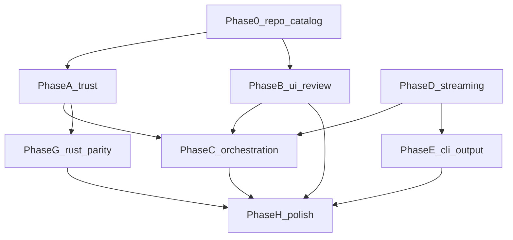
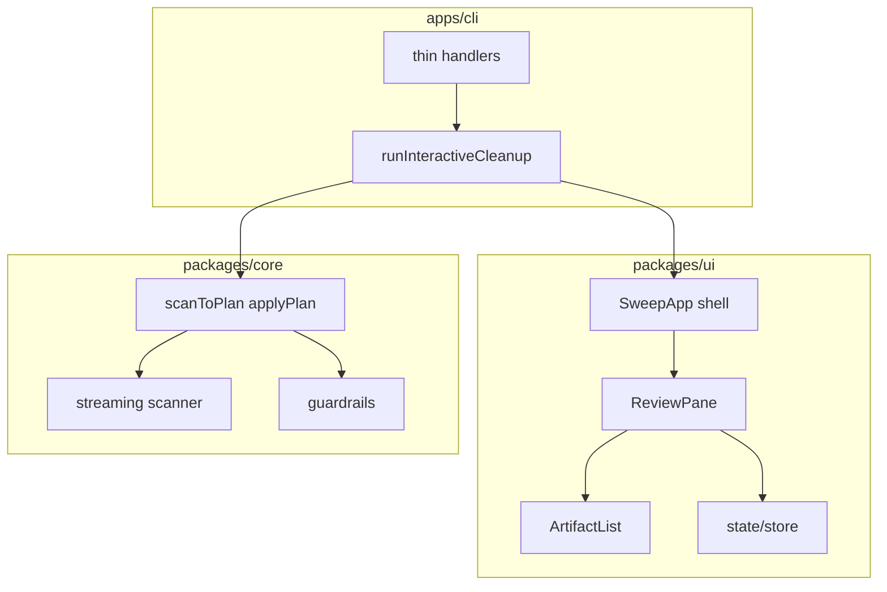

# Sweep unified improvement plan (master)

Status: in_progress
Scope: product · ui · cli · engine · repo
Created: 2026-06-24
Updated: 2026-06-24
Commit: uncommitted (baseline `721dbdb`)

**Canonical location:** `.plans/daily-driver-overhaul/` — this file is the single
entry point for humans and agents. Child `*.md` files hold step-by-step executor
instructions; do not duplicate full steps here.

**Supersedes:** Cursor plans `sweep_overhaul_roadmap_ce1b8314`, `catalog_and_bun_types_*`,
and scattered advisor `plans/` at repo root (removed).

**References:** `.interface-design/system.md`, `.docs/product-direction.md`,
`.plans/product-architecture-roadmap.md`, ghui, hunk.

---

## Goal

Trustworthy, fast, cross-platform artifact cleanup with a TUI on par with ghui/hunk,
desktop-scale scanning, coherent CLI usage, and a maintainable module architecture.

---

## How to use this plan (agents)

1. Read this file for **order and dependencies**.
2. Open **one child plan** for the area you are implementing.
3. Run verification after each child plan: `bun run check` (+ `bun run rust:check` if `crates/` touched).
4. Update child plan `Status` / `Commit` and the [README](./README.md) table when done.

| Task                              | Child plan                                               |
| --------------------------------- | -------------------------------------------------------- |
| Catalog, `@types/bun`, P0 hygiene | [repo-catalog-hygiene.md](./repo-catalog-hygiene.md)     |
| Apply safety, Windows, junctions  | [trust-guardrails.md](./trust-guardrails.md)             |
| TUI ghui parity                   | [ui-review-pane.md](./ui-review-pane.md)                 |
| scan→review→apply seam            | [orchestration-seam.md](./orchestration-seam.md)         |
| Async scanner / cleaner           | [streaming-engine.md](./streaming-engine.md)             |
| CLI output / exit codes           | [cli-output.md](./cli-output.md)                         |
| Rust parity                       | [rust-engine-parity.md](./rust-engine-parity.md)         |
| init, doctor, docs, e2e           | [daily-driver-polish.md](./daily-driver-polish.md)       |
| Why modules are shaped this way   | [architecture-deepening.md](./architecture-deepening.md) |

---

## Lineage: original roadmap vs this plan

Original Cursor roadmap phases P0–P6 mapped to this scope:

| Original     | This plan                                                                                        | Notes                          |
| ------------ | ------------------------------------------------------------------------------------------------ | ------------------------------ |
| P0 Hygiene   | **Phase 0** [repo-catalog-hygiene](./repo-catalog-hygiene.md)                                    | + catalog/`@types/bun`         |
| P1 Safety    | **Phase A** [trust-guardrails](./trust-guardrails.md)                                            |                                |
| P2 Streaming | **Phase D** [streaming-engine](./streaming-engine.md)                                            |                                |
| P3 React TUI | **Phase B** [ui-review-pane](./ui-review-pane.md)                                                | partial: scrollbox list landed |
| P4 CLI UX    | **Phase E** [cli-output](./cli-output.md) + **Phase C** [orchestration](./orchestration-seam.md) |                                |
| P5 Rust      | **Phase G** [rust-engine-parity](./rust-engine-parity.md)                                        |                                |
| P6 Polish    | **Phase H** [daily-driver-polish](./daily-driver-polish.md)                                      |                                |

---

## Execution order (dependency graph)



**Recommended serial order for a single executor:**

1. **Phase 0** — [repo-catalog-hygiene.md](./repo-catalog-hygiene.md) (S, unblocks everyone)
2. **Phase A** — [trust-guardrails.md](./trust-guardrails.md) (S, trust-first)
3. **Phase B** — [ui-review-pane.md](./ui-review-pane.md) (M, in progress)
4. **Phase D** — [streaming-engine.md](./streaming-engine.md) (L, can parallel B after A)
5. **Phase C** — [orchestration-seam.md](./orchestration-seam.md) (M, needs B + D hooks)
6. **Phase E** — [cli-output.md](./cli-output.md) (S, partial parallel with C)
7. **Phase G** — [rust-engine-parity.md](./rust-engine-parity.md) (L, after A + D)
8. **Phase H** — [daily-driver-polish.md](./daily-driver-polish.md) (M, last)

---

## Usage model (target UX)

| Command                 | TTY      | Behavior                                                 |
| ----------------------- | -------- | -------------------------------------------------------- |
| `sweep` / `sweep clean` | yes      | Scan → progressive feedback → confirm → apply            |
| `sweep` / `sweep clean` | no       | Scan → grouped summary / `--json`                        |
| `sweep ui`              | required | Scan → review → rescan/apply loop (in-TUI after Phase C) |
| `sweep scan`            | either   | Inspect; `--json` / `--json-stream` for automation       |

TUI: sidebar scopes, filter, risk filter 1–4, patterns + rescan, space/s/a/u,
dangerous confirm gate, `?` help, theme cycle. Design system:
`.interface-design/system.md`.

---

## Architecture (target)

See [architecture-deepening.md](./architecture-deepening.md) for rationale.



**Seams:** Engine (JS/Rust), Review (`runSweepUi`), Orchestration
(`runInteractiveCleanup`), Presentation (display + ui — later).

---

## Already landed (this branch)

- `@opentui/react` TUI (`packages/ui/src/app.tsx`)
- Scrollbox artifact list + inline scope headers (`ArtifactList.tsx`) — fixes joined-header blob
- Pure UI reducers + `app.test.tsx`
- Help overlay, confirm gate, risk filter, responsive sidebar (partial P3)

---

## Phase summaries

### Phase 0 — Repo and catalog

[repo-catalog-hygiene.md](./repo-catalog-hygiene.md): lint-staged, turbo fixtures,
unused deps, **`@types/bun` migration**, fix `peerDependencies` `catalog:` on published CLI.

### Phase A — Trust

[trust-guardrails.md](./trust-guardrails.md): apply path containment, Windows roots,
junctions, `blocked` tier producer.

### Phase B — TUI depth

[ui-review-pane.md](./ui-review-pane.md): `ReviewPane`, keymap slice, hover, empty states,
in-TUI rescan overlay (after C).

### Phase C — Orchestration

[orchestration-seam.md](./orchestration-seam.md): one scan→review→apply flow; thin `ui.ts`.

### Phase D — Streaming engine

[streaming-engine.md](./streaming-engine.md): async scan/clean, bench harness, time-to-first-result.

### Phase E — CLI output

[cli-output.md](./cli-output.md): no double-print, doctor exit codes, `--json` gaps.

### Phase G — Rust parity

[rust-engine-parity.md](./rust-engine-parity.md): guardrails, streaming, batched du, contract tests.

### Phase H — Polish

[daily-driver-polish.md](./daily-driver-polish.md): `sweep init`, `sweep clean`, docs, e2e.

---

## OpenTUI rules (all UI work)

- `scrollbox` for mixed header/item lists; `select` only for homogeneous lists
- Global `useKeyboard` must not steal keys when filter `<input>` is focused
- Tests: `@opentui/react/test-utils` + `captureCharFrame`
- Borders-only depth; palette from `.interface-design/system.md`

---

## Success criteria (program complete)

- [ ] Phase 0: `@types/bun` everywhere; publish peers use literal semver
- [ ] TUI matches ghui/hunk scannability (groups, hover, footer)
- [ ] No duplicated rescan/apply logic in handlers
- [ ] Apply cannot escape `targetDir`; Windows/junction tests green
- [ ] First candidate during walk on large fixture; bench documented
- [ ] Rust contract tests match JS for streaming + guardrails
- [ ] `bun run check` + `bun run rust:check` green
- [ ] `sweep ui .` feels good as a daily driver

---

## Validation (every phase)

```bash
bun run check
bun run rust:check    # when crates/ changes
bun run preflight     # before publish
```

Update `Status`, `Updated`, and `Commit` in the child plan and [README](./README.md).
